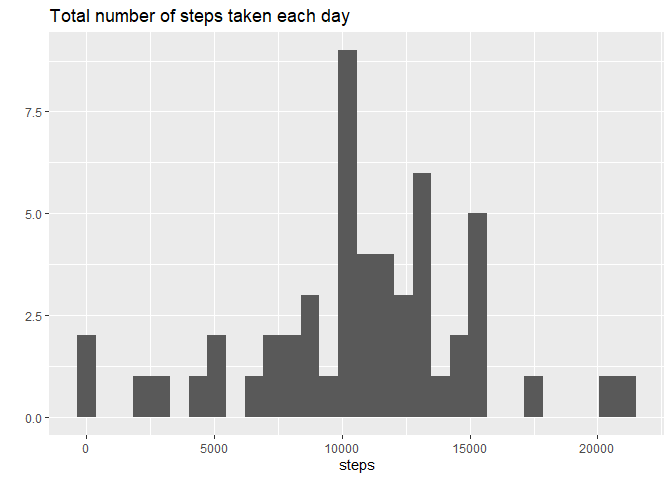
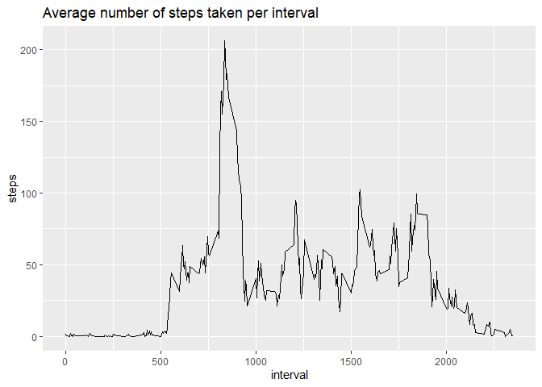
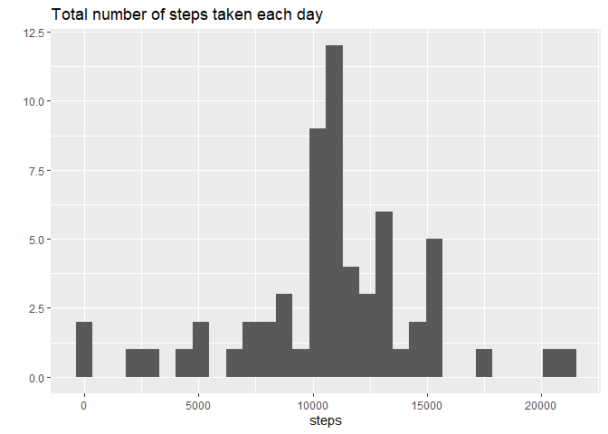
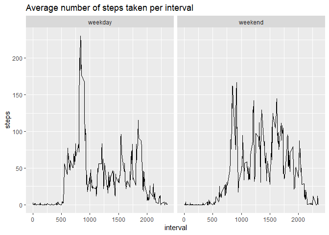

```r
library(tidyverse)
```

## Loading and preprocessing the data
We start with unzipping and loading the data. Additionally, the date column is being converted to a date class.

```r
unzipped <- unzip("activity.zip")
df <- read.csv(unzipped)
df$date <- as.Date(df$date, "%Y-%m-%d")
```


## What is the mean total number of steps taken per day?
To find out what the mean total number of steps taken per day is, we'll start with a graph of the distribution of the data.

```r
steps_by_day <- df %>%
                  group_by(date) %>%
                  summarise(steps = sum(steps)) %>%
                  drop_na()

qplot(x = steps, data = steps_by_day, main = "Total number of steps taken each day", xlab = "steps")
```

<!-- -->

Having seen the distribution, we'll know calculate the exact mean and median.

```r
avg <- as.integer(mean(steps_by_day$steps, na.rm = TRUE))
med <- median(steps_by_day$steps, na.rm = TRUE)
```
The mean of the total number of steps taken per day is 10766. The median is 10765.


## What is the average daily activity pattern?
The graph below demonstrates the average daily activity pattern.

```r
steps_by_interval <- df %>%
                        group_by(interval) %>%
                        summarise(steps = mean(steps, na.rm = T))

ggplot(data = steps_by_interval, aes(y = steps, x = interval)) +
  geom_line() +
  ggtitle("Average number of steps taken per interval")
```

<!-- -->


```r
max_steps <- max(steps_by_interval$steps)
max_interval <- steps_by_interval[steps_by_interval$steps == max_steps, "interval"]
```
On average across all the days in the dataset, the 835 interval contains the maximum number of steps.

## Imputing missing values
Sadly enough, the dataset contains several missing values.

```r
mis <- sum(is.na(df))
```
The total of missing values in the dataset is 2304.
The absence of these values may have impacted the distribution of the data as demonstrated earlier above.
To compensate for the potential bias, the values will be imputed based on the mean of the corresponding time interval to which they correspond. After imputation, the distribution seems to have slightly changed.

```r
df_imp <- df %>% 
            group_by(interval) %>%
            mutate(steps = ifelse(is.na(steps), mean(steps, na.rm=TRUE), steps))

imputed_steps_by_day <- df_imp %>%
                          group_by(date) %>%
                          summarise(steps = sum(steps))

qplot(x = steps, data = imputed_steps_by_day, main = "Total number of steps taken each day", xlab = "steps")
```

<!-- -->

To measure the effects of the imputation, we'll compare the new mean and median with the earlier values.

```r
avg2 <- as.integer(mean(imputed_steps_by_day$steps, na.rm = TRUE))
med2 <- as.integer(median(imputed_steps_by_day$steps, na.rm = TRUE))
```
Because the values have been imputed with the mean, the mean of the total number of steps taken per day has remained the same: 10766. The median, however, has shifted from 10765 to 10766.


## Are there differences in activity patterns between weekdays and weekends?
Below are the average total steps throughout the day displayed, but separated in two groups. On the one hand weekdays, and on the other hand the weekend. Overall, it seems that activity shifts to the later moments of the day in the weekend compared to the earlier activity during the weekdays.

```r
df_imp$day_type <- as.factor(ifelse(weekdays(df_imp$date) %in% c("zaterdag", "zondag"), "weekend", "weekday"))

grouped <-  df_imp %>%
              group_by(day_type, interval) %>%
              summarise(steps = mean(steps))

ggplot(data = grouped, aes(x = interval, y = steps)) +
  geom_line() +
  facet_wrap(vars(day_type)) +
  ggtitle("Average number of steps taken per interval")
```

<!-- -->
